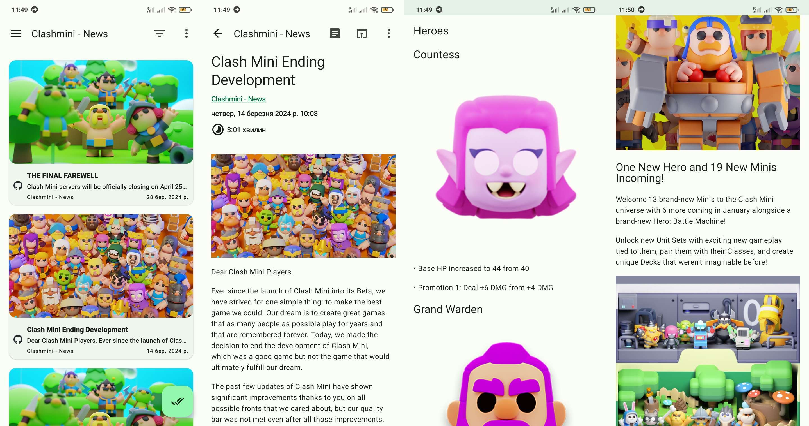
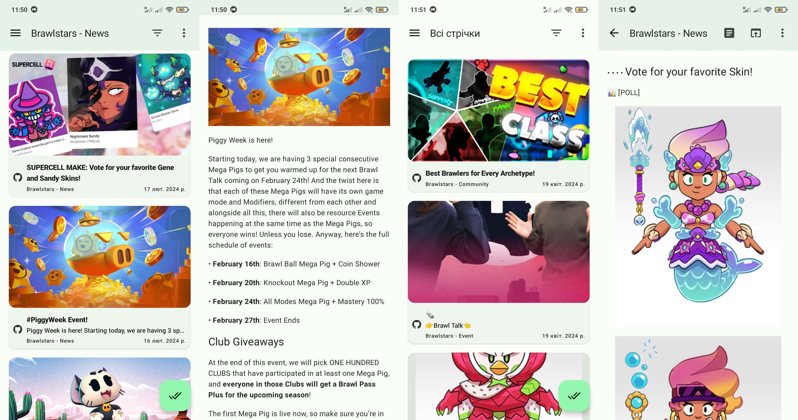

# What's this?
📰 Supercell Inbox RSS provides multilingual RSS & ATOM feeds for the news section of Supercell games powered by GitHub Actions, GitHub Pages & [feedgen](https://github.com/lkiesow/python-feedgen).

⏱️ Updates: `every hour at minute 25!`
*(actually a bit later due to delays)*

# Supported games

|Game Name|News & Events|Community|Esport|
|---------|-------------|---------|------|
|Brawl Stars|✅|✅|✅|
|Clash Royale|✅|✅|✅|
|Clash of Clans|✅|✅|✅|
|Hay Day|✅|✅|❌|
|Boom Beach|✅|✅|❌|
|Clash Mini|💀|❌|❌|
|Squad Busters|✅|❌|❌|

>Note: Clash Mini is dead, so we cannot update the feed

# Available languages

|Game Name|Language Codes|
|---------|--------------|
|Brawl Stars|`zh`, `de`, `ru`, `fr`, `tr`, `ja`, `pl`, `id`, `en`, `pt`, `ko`, `es`, `it`|
|Clash Royale|`th`, `zh`, `de`, `ru`, `fr`, `ja`, `id`, `en`, `pt`, `ko`, `es`, `it`|
|Clash of Clans|`zh`, `de`, `fr`, `tr`, `ja`, `id`, `en`, `pt`, `ko`, `es`, `it`|
|Hay Day|`th`, `ms`, `zh`, `de`, `ru`, `fr`, `tr`, `ja`, `ar`, `fi`, `id`, `en`, `pt`, `ko`, `es`, `nl`, `it`|
|Boom Beach|`en`|
|Clash Mini|`en`, `es`|
|Squad Busters|`zh`, `de`, `ru`, `fr`, `tr`, `ja`, `pl`, `en`, `pt`, `ko`, `es`, `it`|

# Screenshots

*(from awesome FOSS [Feeder app](https://github.com/spacecowboy/Feeder)) for Android*


# Subscribe
To subscribe to feeds, see [./rss/README.md](/rss).

# Missing features? Experiencing problems?
Feel free to file an issue or pull request on GitHub, I will try to look into it ASAP!

# Build & use it locally
To generate these feeds locally, you should:
### 1. Clone this repository
```
git clone https://github.com/skrwo/supercell-inbox-rss.git
```

### 2. Install python 3.11 or newer
(Python installation depends on OS you're using, so google it yourself)

### 3. Open the repo & install its dependencies
```
cd supercell-inbox-rss
pip install -r requirements.txt
```

### 4. Generate feeds!
```
python -m feed
```

# Legal notice
This repository and its maintainers are not affiliated with Supercell. Using it or its source code may violate Terms of Service of Supercell or their games. I leave the responsibility to you.

# Licence
The source code of the Supercell Inbox RSS repository is released under the MIT licence. This basically means that you can do wathever you want with it, I don't care.